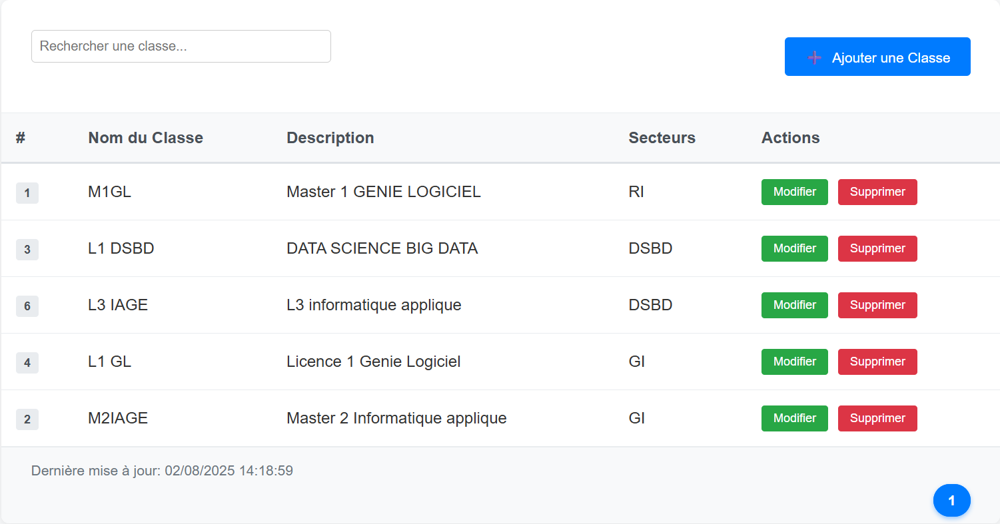
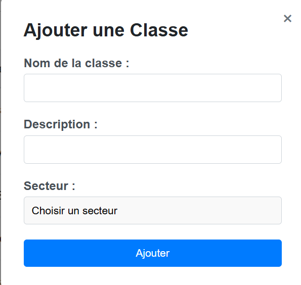
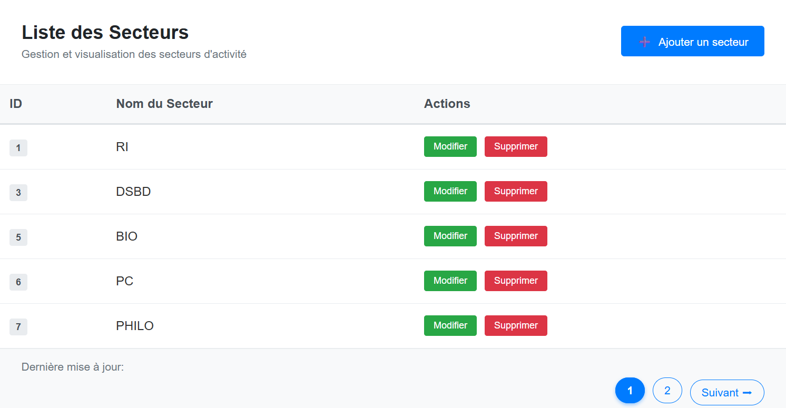
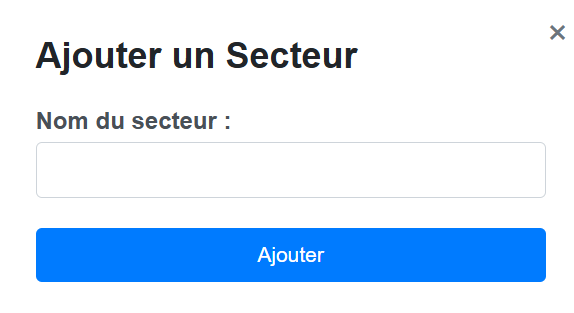
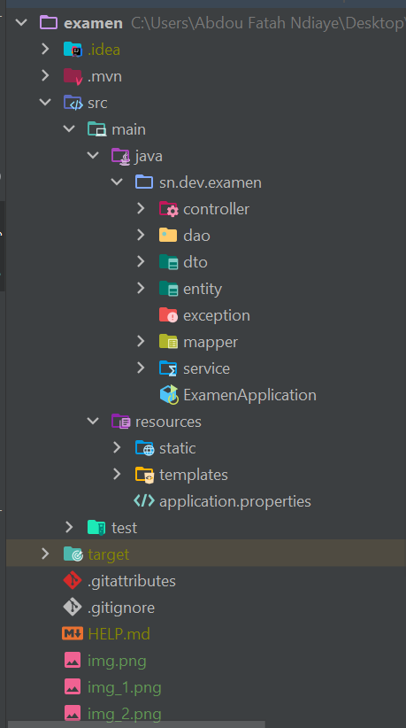

# Gestion des Classes et Secteurs

Application web de gestion des entités **Classe** et **Secteur**, avec liaison entre elles, interface utilisateur via Thymeleaf et base de données PostgreSQL.

---

## Environnement

- **JDK 17**
- Maven 3.9.\
- **PostgreSQL**
- **Spring Boot 3**
- Thymeleaf / HTML / CSS / JavaScript

---

## Captures d’écran
### 🔹 Tableau des Classes


### 🔹 Modal d'ajout d'une classe


### 🔹 Tableau des Secteurs


### 🔹 Modal d'ajout d'un Secteur


## Architecture du Projet

Voici la structure principale du projet :



## Cloner le projet
```bash
git clone https://github.com/NDIAYEFATAH/springboot-thymeleaf.git
cd examen 
```

